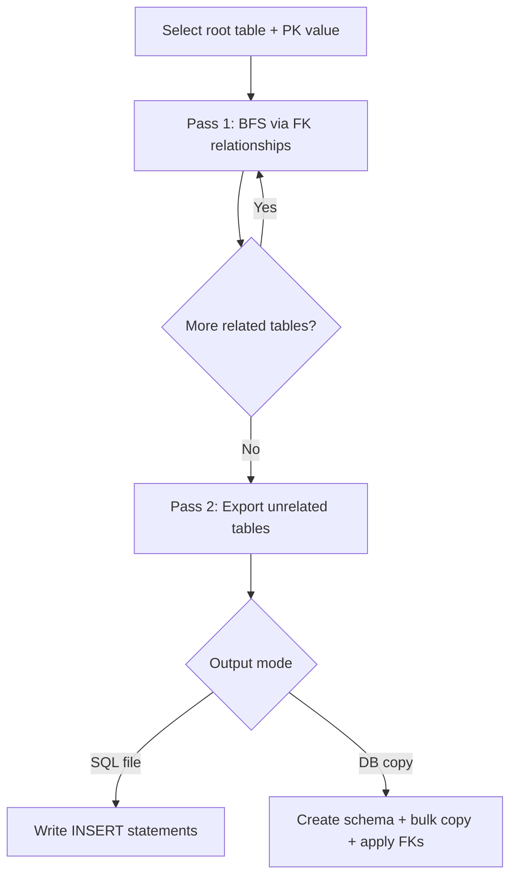

# DBSubsetter

Create small, referentially consistent database subsets from large production databases — ideal for dev, QA, demos, and debugging.

DBSubsetter starts from a single **root row** and walks foreign-key relationships to pull related data. It can also export lookup tables that are not connected to the root. Output goes to a SQL script or, for SQL Server, directly into another database.


---

## Why DBSubsetter?

Copying an entire database for local development is slow, expensive, and often impossible due to size or compliance. DBSubsetter gives you a **focused slice** of real data:

- Start from one meaningful record (a customer, division, order, etc.)
- Follow FK links automatically so child and parent rows stay consistent
- Cap row counts per table so subsets stay manageable
- Exclude noisy tables (logs, audit trails) or filter rows with custom `WHERE` clauses
- Save and reuse configurations as project files

---

## Features

| Feature | Description |
|---------|-------------|
| **Multi-database sources** | SQL Server, SQLite, MySQL, PostgreSQL |
| **Guided wizard UI** | Step-by-step setup: connect → pick root → configure tables → choose output → run |
| **FK-aware traversal** | Breadth-first walk from the root row through referencing tables |
| **Unrelated tables** | Exports tables with no FK path to the root (useful for lookup/reference data) |
| **Per-table controls** | Include/exclude tables, optional `WHERE` filters, configurable row cap |
| **Two output modes** | SQL file (`INSERT` statements) or direct SQL Server → SQL Server copy |
| **Data browser** | Explore tables and pick a root row visually |
| **Connection profiles** | Save and reuse source connection settings |
| **Project files** | Persist subset definitions as `.dbsubset` files |

### Output modes by provider

| Provider | SQL file | Direct DB copy |
|----------|:--------:|:--------------:|
| SQL Server | ✓ | ✓ |
| SQLite | ✓ | — |
| MySQL | ✓ | — |
| PostgreSQL | ✓ | — |

---

## How it works



1. **Pass 1 — Related data:** Starting from the root primary key, DBSubsetter discovers tables that reference the current table via foreign keys, collects matching child rows (up to the per-table limit), and continues until the graph is exhausted.

2. **Pass 2 — Unrelated data:** Tables not reachable through any FK path from the root are exported separately (still respecting include/exclude rules and row limits). This captures standalone reference data like countries, status codes, or config tables.

3. **Output:**
   - **File mode** writes `INSERT` statements to a `.sql` file.
   - **DB mode** (SQL Server only) creates tables in the destination, bulk-copies rows with identity preservation, then applies foreign key constraints.

---

## Requirements

- **Windows** (WPF desktop app)
- **[.NET 8 SDK](https://dotnet.microsoft.com/download/dotnet/8.0)**
- Network access to your source database (and destination, if using DB copy mode)

---

## Getting started

### Clone and build

```powershell
git clone <repository-url>
cd DBSubsetter
dotnet build DbSubsetter.sln -c Release
```

### Run the app

```powershell
dotnet run --project DbSubsetter.UI -c Release
```

Or launch the built executable:

```
DbSubsetter.UI\bin\Release\net8.0-windows\DbSubsetter.UI.exe
```

---

## Using the wizard

The UI walks through five steps:

| Step | What you configure |
|------|--------------------|
| **1. Connection** | Source provider, server/file, credentials. Click **Test Connection** to verify and load tables. |
| **2. Root Data** | Root table, primary key value (type manually, load sample rows, or use the **Browser**). |
| **3. Tables** | Include/exclude tables and optionally add per-table `WHERE` clauses. Set **Max rows per table**. |
| **4. Destination** | SQL file path, or a destination SQL Server database for direct copy. |
| **5. Run** | Execute the subset and monitor progress, elapsed time, and row counts. |

### Tips

- **Save your work** as a `.dbsubset` project file so you can reopen the same configuration later.
- Use **connection profiles** for databases you subset frequently.
- Passwords are **not** stored in project files — you'll need to re-enter them after loading a project.
- The **Browser** window lets you drill into related tables and click a row to set the root entry point.
- For large schemas, exclude audit/log tables before running to keep output small.

---

## Project files

Subset configurations are saved as JSON-based `.dbsubset` files containing:

- Source connection details (except password)
- Root table and PK value
- Table include/exclude rules and `WHERE` filters
- Row limits and output settings

Use **File → Save Project** / **Open Project** from the menu, or pick from recent projects on startup.

---

## Using the core library

The subset engines live in `DbSubsetter.Core` and can be referenced from your own .NET projects.

### SQL Server → SQL file

```csharp
using DbSubsetter.Core;

var progress = new Progress<SubsetProgress>(p => Console.WriteLine(p.Message));

var engine = new SubsetEngine(
    connStr: "Server=...;Database=...;Trusted_Connection=True;TrustServerCertificate=True",
    rootTable: "[dbo].[Customers]",
    rootPkVal: "42",
    outFile: "subset.sql",
    maxRowsPerTable: 1000,
    progress: progress,
    excludedTables: new[] { "[dbo].[AuditLog]" },
    tableFilters: new Dictionary<string, string>
    {
        ["[dbo].[Orders]"] = "Status = 'Active'"
    });

await engine.RunAsync();
Console.WriteLine($"{engine.TotalOut:N0} rows written.");
```

### SQL Server → SQL Server (direct copy)

```csharp
var engine = new SubsetEngine(
    connStr: sourceConnectionString,
    rootTable: "[dbo].[Customers]",
    rootPkVal: "42",
    destConnStr: destinationConnectionString,
    maxRowsPerTable: 1000);

await engine.RunAsync();
```

### Other providers

Use the provider-specific engines — all write to a SQL file:

```csharp
// SQLite
await new SubsetEngineSqlite(connStr, rootTable, rootPkVal, "subset.sql").RunAsync();

// MySQL
await new SubsetEngineMySql(connStr, rootTable, rootPkVal, "subset.sql").RunAsync();

// PostgreSQL
await new SubsetEnginePostgres(connStr, rootTable, rootPkVal, "subset.sql").RunAsync();
```

---

## Solution structure

```
DBSubsetter/
├── DbSubsetter.sln
├── DbSubsetter.Core/          # Subset engines, schema exploration, scripting
│   ├── SubsetEngine.cs        # SQL Server engine (file + DB modes)
│   ├── SubsetEngineSqlite.cs
│   ├── SubsetEngineMySql.cs
│   ├── SubsetEnginePostgres.cs
│   ├── SchemaExplorer*.cs     # Per-provider metadata queries
│   └── SchemaScripter.cs      # DDL generation for DB copy mode
└── DbSubsetter.UI/            # WPF wizard application
    ├── MainWindow.xaml
    ├── BrowseWindow.xaml      # Interactive data browser
    └── SubsetProject.cs       # Project file model
```

---

## Dependencies

| Package | Used for |
|---------|----------|
| [Microsoft.Data.SqlClient](https://www.nuget.org/packages/Microsoft.Data.SqlClient) | SQL Server |
| [Microsoft.Data.Sqlite](https://www.nuget.org/packages/Microsoft.Data.Sqlite) | SQLite |
| [MySqlConnector](https://www.nuget.org/packages/MySqlConnector) | MySQL |
| [Npgsql](https://www.nuget.org/packages/Npgsql) | PostgreSQL |

---

## Limitations

- The WPF UI targets **Windows** only.
- Direct database copy is supported for **SQL Server → SQL Server** only; other providers export to SQL files.
- Subsetting relies on **primary keys** and **foreign keys** being defined in the database schema.
- Per-table row limits apply independently; very wide FK graphs may still produce large outputs if many tables are included.

---

## Contributing

Issues and pull requests are welcome. When contributing, please keep changes focused and match the existing code style.
